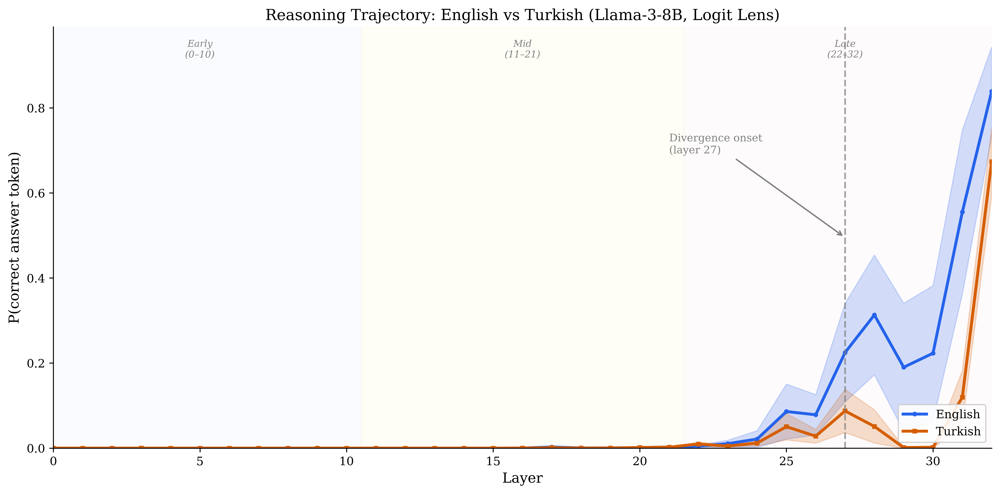

# Logit Lens Analysis of Turkish vs English Reasoning in Llama-3-8B

> A mechanistic interpretability pilot study examining *where* multilingual reasoning diverges inside a large language model.

**[Read the full report (PDF)](report/report.pdf)**



## Key Findings

**1. Late-layer divergence.** Llama-3-8B reaches P(answer) = 0.84 at the final layer for English math prompts versus 0.67 for Turkish (with English prompt frame) — a 17pp gap that emerges almost entirely in the late layers (22–32). Divergence onset is at layer 27 (median), with a large effect size in the late region and essentially zero divergence in early/mid layers.

**2. The prompt frame matters enormously.** When Turkish questions use a Turkish prompt frame ("Soru: ... Cevap:") instead of the English frame ("Q: ... A: The answer is"), P(answer) drops from 0.67 to 0.12. This reveals that much of the base model's Turkish "reasoning" in the logit lens depends on the English frame bootstrapping output — the model may be performing cross-lingual transfer through the prompt rather than native Turkish reasoning. This finding motivates the activation patching study proposed in the research statement.

### Results Summary

| Metric | Value |
|--------|-------|
| Behavioral accuracy (Instruct, CoT) | EN: 33.3% [95% CI: 15.2–58.3] vs TR: 40.0% [19.8–64.3] |
| Final-layer P(answer) — English frame | EN: 0.84 vs TR: 0.67 |
| Final-layer P(answer) — Turkish frame | TR: 0.12 |
| Median divergence onset | Layer 27 of 32 |
| Divergence pattern | Late divergence (100% of problems) |
| Late-region effect size | Hedges' g = 1.04, p < 0.005 (Holm-Bonferroni corrected) |
| Mid-region effect size | Hedges' g = 0.26, p = 0.310 (n.s.) |
| Token fertility ratio | 1.38x (TR/EN) |
| Fisher's exact test (behavioral) | p = 1.000 (n.s. at n=15) |

## Motivation

LLMs can solve competition-level math in English, yet chain-of-thought reasoning *degrades* performance in Turkish for weaker models ([Yuksel et al., 2024](https://arxiv.org/abs/2407.12402)), and even GPT-4 fails at morphological compositional generalization in agglutinative languages ([Ismayilzada et al., 2025](https://arxiv.org/abs/2410.12656)). Recent logit-lens analysis confirms that latent reasoning collapses entirely in low-resource languages for hard tasks ([Liu et al., 2026](https://arxiv.org/abs/2601.02996)). But existing benchmarks only measure *how much* reasoning degrades — not *where in the model* or *at which reasoning step* failures originate.

This pilot study applies the **logit lens** ([nostalgebraist, 2020](https://www.lesswrong.com/posts/AcKRB8wDpdaN6v6ru/interpreting-gpt-the-logit-lens)) to trace where Turkish reasoning diverges from English inside Llama-3-8B, directly validating the diagnostic approach proposed in the accompanying research statement for the PhD position at the [Chair of Intelligent Language Systems](https://www.ils.research.fau.eu/) (FAU Erlangen-Nurnberg).

## Method

### Data
- **15 matched grade school math problems** from [GSM8K](https://huggingface.co/datasets/openai/gsm8k) (English) and [GSM8K-TR](https://huggingface.co/datasets/malhajar/gsm8k-tr) (Turkish)
- Same numeric answer across language pairs, stratified by difficulty (2–8 reasoning steps)

### Model
- **Meta-Llama-3-8B** via [NousResearch/Meta-Llama-3-8B](https://huggingface.co/NousResearch/Meta-Llama-3-8B) (base model, 32 transformer layers, 4096 hidden dim)
- Base model used for interpretability analysis; Instruct variant ([NousResearch/Meta-Llama-3-8B-Instruct](https://huggingface.co/NousResearch/Meta-Llama-3-8B-Instruct)) used only for behavioral baseline

### Logit Lens
For each of the 33 hidden state positions (embedding layer + 32 transformer layers), we project the residual stream through the final RMSNorm and unembedding matrix to obtain a probability distribution over the vocabulary. We track **P(correct answer token)** across layers — this "reasoning trajectory" reveals where the model forms its answer.

**Critical implementation detail**: Llama-3's final RMSNorm sits between the last transformer block and the unembedding head. Applying it is essential for meaningful logit lens results (see also [Belrose et al., 2023](https://arxiv.org/abs/2303.08112) on the importance of normalization for logit lens accuracy).

**Sanity check**: On "The capital of France is", the logit lens correctly tracks the model's processing — early layers produce noise (L0: 'jav'), mid layers begin forming semantic content (L20: 'located', p=0.18), and late layers converge to the answer (L30: 'Paris', p=0.53; L32: 'Paris', p=0.55).

### Controls
- **Random baseline**: We track P(wrong answer) for 5 random distractor numbers per problem as a sanity check. Note that the `max` aggregation over tokenization variants can inflate baseline probabilities for common numbers — this baseline should be interpreted cautiously
- **Turkish-framed prompts**: We test Turkish prompts with a Turkish frame ("Soru: ... Cevap:") in addition to the English frame ("Q: ... A: The answer is") to disentangle prompt-frame effects from reasoning ability. This control reveals a dramatic drop (P = 0.67 → 0.12), suggesting the English frame is critical for Turkish answer extraction

### Metrics
| Metric | What it measures |
|--------|-----------------|
| Per-layer P(answer) | How confident the model is about the correct answer at each layer |
| Jensen-Shannon divergence | How different EN and TR processing strategies are at each layer |
| Divergence onset layer | First layer where \|P_EN - P_TR\| > 0.1 |
| Token fertility ratio | Tokenization tax (TR tokens / EN tokens per problem) |
| Entropy trajectory | Model uncertainty across layers |
| Random baseline P(wrong) | Sanity check comparing P(correct) to P(arbitrary number) |

### Statistical Methods
- **Paired permutation test**: Exact enumeration for n <= 20, Monte Carlo (100K permutations) otherwise — appropriate for small samples without normality assumptions
- **Holm-Bonferroni correction**: Applied to layer region comparisons (3 tests) to control family-wise error rate
- **Hedges' g**: Small-sample corrected Cohen's d for effect sizes
- **Wilson score CI**: Confidence intervals for behavioral accuracy proportions
- **Fisher's exact test**: For the 2x2 language x correctness contingency table

### Pipeline

```
GSM8K (EN)───┐                        ┌──── Instruct Model ─────────────────────┐
             ├─ Match by index ─ 15 ──┤     (Llama-3-8B-Instruct)              │
GSM8K-TR ────┘  (same answer)  problems│                                        │
                                       │  EN: "Q: ... A: Let's solve step by   │
                                       │       step." ──→ generate ──→ extract  │
                                       │  TR: "Soru: ... Cevap: Bunu adım      │
                                       │       adım çözelim." ──→ same         │
                                       │           │                            │
                                       │           ▼                            │
                                       │  Accuracy, Wilson CIs, Fisher's exact  │
                                       │  Token fertility (TR/EN tokens)        │
                                       │           │                            │
                                       │           ▼ Fig 1                      │
                                       └────────────────────────────────────────┘

                                       ┌──── Base Model ────────────────────────┐
                                       │     (Llama-3-8B)                       │
                                       │                                        │
                                       │  For each problem (×15):               │
                                       │                                        │
                                       │  prompt ──→ tokenize ──→ forward pass  │
                                       │                              │         │
                                       │            33 hidden states (emb + 32) │
                                       │                              │         │
                                       │            For each layer:   ▼         │
                                       │         ┌─────────────────────────┐    │
                                       │         │ h = hidden[last_token]  │    │
                                       │         │        ↓               │    │
                                       │         │ RMSNorm (critical)     │    │
                                       │         │        ↓               │    │
                                       │         │ lm_head → logits       │    │
                                       │         │        ↓               │    │
                                       │         │ softmax (float32)      │    │
                                       │         │        ↓               │    │
                                       │         │ P(answer), top-k,      │    │
                                       │         │ entropy                │    │
                                       │         └─────────────────────────┘    │
                                       │                                        │
                                       │  Three conditions:                     │
                                       │   ① EN: "Q: ... A: The answer is"      │
                                       │   ② TR: "Q: ... A: The answer is"      │
                                       │   ③ TR: "Soru: ... Cevap:" (control)   │
                                       │                                        │
                                       └──────────────┬─────────────────────────┘
                                                      │
                           ┌──────────────────────────┼──────────────────────────┐
                           ▼                          ▼                          ▼
                    Trajectory Analysis      Divergence Analysis         Controls
                    ┌────────────────┐      ┌──────────────────┐   ┌────────────────┐
                    │ Aggregate      │      │ Onset: first     │   │ Random baseline │
                    │ P(answer)      │      │ layer |Δ|>0.1    │   │ (5 distractors) │
                    │ mean ± t-CI    │      │                  │   │                 │
                    │ across 15      │      │ Regions:         │   │ Turkish frame   │
                    │ problems       │      │  Early (0-10)    │   │ vs English frame│
                    │                │      │  Mid  (11-21)    │   │                 │
                    │ JS divergence  │      │  Late (22-32)    │   │ Fertility vs    │
                    │ per layer      │      │                  │   │ P(answer) gap   │
                    │                │      │ Hedges' g +      │   │                 │
                    └───────┬────────┘      │ permutation test │   └───────┬─────────┘
                            │               │ + Holm-Bonferroni│           │
                            │               └────────┬─────────┘           │
                            ▼                        ▼                     ▼
                    Figs 2, 6, 8, 9          Figs 3, 4, 7              Fig 5
```

## Analyses

### 1. Behavioral Baseline
Accuracy comparison on 15 matched problems using Llama-3-8B-Instruct with chain-of-thought prompting. English accuracy (33.3%) and Turkish accuracy (40.0%) are comparable on this sample (Fisher's exact p = 1.0) — the base model's logit lens reveals a more nuanced picture beneath similar behavioral performance.

### 2. Reasoning Trajectory Divergence
The core analysis: aggregate P(correct answer) across layers, averaged over 15 problems with 95% CI. English trajectories converge to the correct answer faster and with higher final probability. A random baseline provides context by tracking P(wrong answer) for distractor numbers.

### 3. Divergence Localization
Where does divergence concentrate? Layer region boundaries are derived from the model architecture (thirds of 33 states), with Hedges' g effect sizes and Holm-Bonferroni-corrected permutation tests.

### 4. Tokenization Confound Control
Testing whether the reasoning gap is explained by tokenization fragmentation alone, or reflects deeper processing differences. We plot P(answer) gap against fertility ratio and fit a trend line. This addresses a key challenge identified in the research statement.

### 5. English Pivot Detection
Replicating [Wendler et al. (2024)](https://arxiv.org/abs/2402.10588) on reasoning tasks: do Turkish prompts produce English-like predictions in mid-layers? Numeric tokens and punctuation are filtered out to avoid false positives from language-neutral tokens.

### 6. JS Divergence Heatmap
Per-problem, per-layer Jensen-Shannon divergence reveals which problems show the most cross-lingual processing divergence and where.

### 7. Difficulty Interaction
Do harder problems (more reasoning steps) show earlier divergence?

## Implications for Proposed Research

This pilot validates the feasibility of the diagnostic approach proposed in the research statement:

1. **The logit lens identifies where reasoning diverges** — all 15 problems show a consistent late-layer (L22–32) divergence pattern, with the gap emerging at layer 27 (median)
2. **Layer region analysis reveals the failure stage** — near-zero divergence in early/mid layers (Hedges' g = 0.26, n.s.) but large divergence in late layers (Hedges' g = 1.04, corrected p < 0.005), suggesting the failure is in output/decoding rather than encoding
3. **The English frame is load-bearing** — Turkish P(answer) drops from 0.67 to 0.12 when switching from English to Turkish prompt frame, revealing that the base model relies on cross-lingual transfer through the English frame rather than native Turkish decoding. This motivates the activation patching study in the research statement: *which specific layer mechanisms perform this cross-lingual transfer?*
4. **Similar behavioral accuracy** (EN 33%, TR 40%) paired with divergent logit lens trajectories shows that the logit lens reveals internal processing differences invisible to behavioral evaluation alone
5. **Next step**: activation patching to establish *causality* at the identified late layers (Direction 1 of the research statement)
6. **Targeted interventions** at layers 27–32 could outperform blind ablation ([Zhao et al., 2025](https://arxiv.org/abs/2412.14869)) (Direction 2)

## Limitations

This is a pilot study designed to validate the feasibility of a diagnostic approach. Key limitations:

- **Small sample** (n=15): Effect sizes and divergence patterns are consistent, but statistical power is limited. The full study would scale to 100+ matched problems.
- **Single model**: Results from Llama-3-8B may not generalize to other architectures. The full study would compare across model families.
- **Logit lens assumptions**: The logit lens is a linear probe that may not capture nonlinear intermediate representations faithfully. The [tuned lens](https://arxiv.org/abs/2303.08112) (Belrose et al., 2023) could provide more calibrated intermediate predictions.
- **English prompt frame confound**: The primary analysis uses an English prompt frame ("Q: ... A: The answer is") for both languages. Our Turkish-frame control (P = 0.12 vs 0.67) shows this frame is load-bearing — the observed EN-TR gap in the main analysis conflates reasoning ability with prompt-frame effects. Disentangling these requires activation patching (proposed Direction 1).
- **Random baseline caveat**: The `max` aggregation over tokenization variants can inflate P(wrong answer) for common numbers. This baseline should be interpreted as a rough sanity check, not a precise null distribution.
- **First-token approximation**: Multi-token answers are tracked via their first BPE token only. Answers like "125" may tokenize differently across contexts.
- **No causal evidence**: The logit lens is correlational. Activation patching would be needed to establish that the identified layers are *causally* responsible for the divergence.

## Reproduction

```bash
# Clone and install
git clone https://github.com/toprak1919/turkish-reasoning-logit-lens.git
cd turkish-reasoning-logit-lens
pip install -r requirements.txt

# Set HuggingFace token (requires Llama-3 access)
export HF_TOKEN=your_token_here

# Run everything (~2 hours on A100)
bash scripts/run_all.sh
```

Or open the notebooks directly in Colab:

| Notebook | Description | Colab |
|----------|-------------|-------|
| `01_behavioral_baseline` | Accuracy comparison EN vs TR | [](https://colab.research.google.com/github/toprak1919/turkish-reasoning-logit-lens/blob/main/notebooks/01_behavioral_baseline.ipynb) |
| `02_logit_lens_analysis` | Core mechanistic analysis | [](https://colab.research.google.com/github/toprak1919/turkish-reasoning-logit-lens/blob/main/notebooks/02_logit_lens_analysis.ipynb) |
| `03_visualizations` | Publication-quality figures | [](https://colab.research.google.com/github/toprak1919/turkish-reasoning-logit-lens/blob/main/notebooks/03_visualizations.ipynb) |
| `04_bonus_analyses` | Tokenization, English pivot, difficulty | [](https://colab.research.google.com/github/toprak1919/turkish-reasoning-logit-lens/blob/main/notebooks/04_bonus_analyses.ipynb) |

### Requirements
- **GPU**: A100 40GB recommended (Colab Pro works)
- **VRAM**: ~16GB for Llama-3-8B in float16
- **Runtime**: ~2 hours total for all analyses

## Project Structure
```
turkish-reasoning-logit-lens/
├── README.md
├── requirements.txt
├── configs/default.yaml
├── run_colab.py            # End-to-end Colab runner
├── src/
│   ├── model.py            # LlamaWrapper with hidden state extraction
│   ├── logit_lens.py       # Core logit lens + JS divergence + random baseline
│   ├── data.py             # Dataset loading, EN-TR matching, prompts
│   ├── metrics.py          # Permutation tests, Holm-Bonferroni, Hedges' g
│   ├── visualization.py    # Publication-quality figures (9 figure types)
│   └── utils.py            # Seed, caching, helpers
├── notebooks/
│   ├── 01_behavioral_baseline.ipynb
│   ├── 02_logit_lens_analysis.ipynb
│   ├── 03_visualizations.ipynb
│   └── 04_bonus_analyses.ipynb
├── results/figures/
├── scripts/run_all.sh
└── tests/
```

## References

- nostalgebraist (2020). Interpreting GPT: The Logit Lens. [LessWrong](https://www.lesswrong.com/posts/AcKRB8wDpdaN6v6ru/interpreting-gpt-the-logit-lens).
- Belrose et al. (2023). Eliciting Latent Predictions from Transformers with the Tuned Lens. [arXiv:2303.08112](https://arxiv.org/abs/2303.08112)
- Liu et al. (2026). Large Reasoning Models Are (Not Yet) Multilingual Latent Reasoners. [arXiv:2601.02996](https://arxiv.org/abs/2601.02996)
- Wendler et al. (2024). Do Llamas Work in English? On the Latent Language of Multilingual Transformers. ACL 2024. [arXiv:2402.10588](https://arxiv.org/abs/2402.10588)
- Sahin et al. (2020). LINSPECTOR: Multilingual Probing Tasks for Word Representations. Computational Linguistics.
- Shi et al. (2023). Language Models are Multilingual Chain-of-Thought Reasoners. ICLR 2023.
- Petrov et al. (2023). Language Model Tokenizers Introduce Unfairness Between Languages. NeurIPS 2023.
- Tang et al. (2024). Language-Specific Neurons: The Key to Multilingual Capabilities in LLMs. ACL 2024.
- Zhao et al. (2025). When Less Language is More: Language-Reasoning Disentanglement. NeurIPS 2025.
- Yuksel et al. (2024). TurkishMMLU: Measuring Massive Multitask Language Understanding in Turkish. Findings of EMNLP.
- Ismayilzada et al. (2025). Evaluating Morphological Compositional Generalization in LLMs. NAACL 2025.

## Author

**Toprak Tarkan Dikici** — M.Sc. Philosophy & Computer Science, University of Bayreuth

[toprakdikici.com](https://toprakdikici.com) · [github.com/toprak1919](https://github.com/toprak1919) · [toprakdikici28@gmail.com](mailto:toprakdikici28@gmail.com)

## License

MIT
